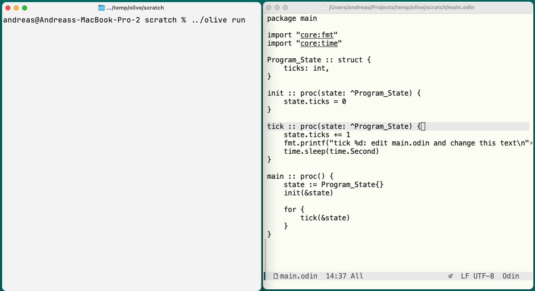
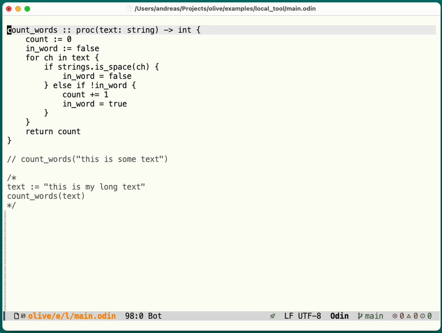

<p align="center">
  
</p>

# Olive

Olive is live-development tooling for Odin.

Its main feature is a small, generic hot-reload workflow for ordinary Odin
programs. Your production program stays normal: it can still be built and run
with `odin build` and `odin run`. Olive adds a reload adapter for development,
so code changes can be rebuilt and loaded into a running host while durable
state is preserved.

Olive also includes scratch eval helpers for quick package-context experiments.
They generate ordinary Odin and use the real Odin compiler.

## Install

Build the CLI:

```sh
odin build cmd/olive -out:olive
```

## Quickstart

```sh
./olive init scratch
cd scratch
../olive run
```

In another terminal:

```sh
cd scratch
../olive watch
```

Now edit the printed text in `main.odin`. Olive builds the changed code and
reloads it into the running program without resetting its durable state, so the
tick counter keeps going.



## Hot Reload

Olive is meant to make the normal edit-build-run cycle feel more like a live
development loop. Keep the program running, edit ordinary Odin files, and let
the reload host pick up the rebuilt module without throwing away state. This is
most useful for games, simulations, editors, UI tools, and other interactive
programs where you have navigated or evolved the program into a state that is
annoying to recreate after every rebuild. Odin builds quickly enough that a
clean stop/build/run loop is still the right answer for many small tools,
libraries, batch jobs, and programs where important state already lives outside
the process.

The development workflow has two moving parts:

- `olive run` starts the program in development mode. It builds a small resident
  host and a reloadable module, then keeps calling your reload adapter's `run`
  proc.
- `olive build` builds the reloadable module manually. `olive watch` does the
  same automatically whenever watched Odin files change.

Your production program stays separate from this. Keep a normal `main` proc and
run it with `odin run .` or build it with `odin build .` when you do not want the
reload workflow involved.


## Getting Started

### Start From Scratch

```sh
./olive init scratch
cd scratch
odin run .
../olive run
```

`olive init` creates a small ordinary Odin program plus a `reload` directory.
The ordinary program lives in `main.odin`: it has a durable state type, an
update proc that prints once per second, and a normal production `main`. The
reload directory contains `reload.odin`, which adapts that program to Olive's
development host.

For the starter, treat `reload/reload.odin` as generated wiring. Edit
`main.odin` and leave the reload package alone unless you are changing how the
development host connects to your program.

The reload adapter contains the development entry point. Its `run` proc is what
Olive calls while the host is alive. In the generated starter that proc advances
the program by one small step, then returns so Olive can check whether a newly
built module is ready to load.

`odin run .` is not required for hot reload. It is there to show that the
generated starter is still a normal Odin program before you run it through
Olive.

### Add Olive To An Existing Project

1. Keep your existing `main` proc as the production entry point.
2. Put durable program data in one root state type, for example
   `Program_State`.
3. Add a small `reload` directory that wires Olive to your program. Start with
   `olive init` in a temporary directory and copy the generated `reload` shape.
4. In `reload/reload.odin`, define `Reload_State :: your_package.Program_State`
   and a `run` proc. Conventional hooks such as `init`, `on_load`, `on_unload`,
   `force_reload`, and `force_restart` are detected when present.

After that setup, normal iteration should happen in your program files, not in
the reload package.

Then run the development host from the project root:

```sh
olive run
```

In another terminal, build the reloadable module when you save changes:

```sh
olive build
```

Or leave the watcher running:

```sh
olive watch
```

`olive run`, `olive build`, and `olive watch` use `reload/` by default. Pass a
reload directory only when your project uses a different location.

If the adapter needs non-default settings, define conventional constants in
`reload/reload.odin`:

```odin
Olive_Module_Name :: "my_game"
Olive_Odin_Args :: "-define:RAYLIB_SHARED=true"
Olive_Watch :: ".."
Olive_Watch_Resources :: "../assets"
Olive_Watch_Ignore :: ".git,.olive,.worktrees"
Olive_Watch_Debounce_MS :: "150"
```

## Reload Adapter

`reload/reload.odin` is the only file Olive reads to understand the reload
setup. Keep it small: import your app package, name the durable state type, and
forward Olive's lifecycle calls to ordinary app procs.

The minimal adapter looks like this:

```odin
package reload

import app ".."
import olive_reload "../../../src/olive_reload"

Reload_State :: app.Program_State

run :: proc(state: ^Reload_State, host: ^olive_reload.Run_Host) {
    _ = host
    app.frame_or_tick(state)
}
```

Required declarations:

- `Reload_State :: app.Program_State`: the one root state type preserved by the
  resident host.
- `run :: proc(state: ^Reload_State, host: ^olive_reload.Run_Host)`: one small
  unit of work. Return regularly so Olive can check for rebuilt code.

Optional lifecycle hooks are detected by name when present:

- `init :: proc(state: ^Reload_State)`: called once for the initial load. Use it
  to mirror production startup state initialization.
- `on_load :: proc(state: ^Reload_State)`: called after a successful reload, not
  on the initial load.
- `on_unload :: proc(state: ^Reload_State)`: called before unloading the current
  generation.
- `on_resource_change :: proc(state: ^Reload_State, path: string)`: called by
  `olive run` when a watched non-code resource changes.
- `force_reload :: proc(state: ^Reload_State) -> bool`: return true to request a
  reload check even if the library timestamp did not change.
- `force_restart :: proc(state: ^Reload_State) -> bool`: return true to reset
  durable state with the current compatible layout.
- `host_init :: proc()`: called once in the resident host before state is
  created. Use this for process-owned resources such as windows.
- `host_shutdown :: proc()`: called once before the resident host exits.

Optional adapter constants:

- `Olive_Module_Name :: "name"`: basename for generated reload binaries.
- `Olive_Odin_Args :: "-define:FOO=true"`: extra args passed to generated
  `odin check` and `odin build` commands.
- `Olive_Watch :: ".."`: comma-separated paths to poll for `.odin` changes,
  relative to the reload directory.
- `Olive_Watch_Resources :: "../assets,../templates"`: comma-separated paths to
  poll for non-code resource changes, relative to the reload directory.
- `Olive_Watch_Ignore :: ".git,.olive,.worktrees"`: comma-separated directory
  names to skip while scanning watched source and resource paths. Names match
  exact path components. Define an empty string to scan all directories.
- `Olive_Watch_Debounce_MS :: "150"`: quiet period after a detected change
  before rebuilding.

Host hooks are for resources that should not be recreated on every reload. For
example, the Raylib example opens the window in `host_init`, closes it in
`host_shutdown`, and keeps drawing one frame per `run`.

### Resource Watching

Code reload and resource reload are separate. `olive watch` watches Odin source
files and rebuilds the reloadable module. `olive run` can also watch external
resource files and notify the running program without rebuilding or swapping the
module.

Resource watching is useful beyond games. Games can reload shaders, textures,
levels, and audio. UI/editor tools can reload themes, templates, documents, or
preview data. Simulations can reload scenario files, parameter sets, or input
datasets.

Add resource paths and a hook to the adapter:

```odin
Olive_Watch_Resources :: "../assets,../templates"

on_resource_change :: proc(state: ^Reload_State, path: string) {
    app.reload_resource(state, path)
}
```

The hook receives the changed path and decides what to do. Olive ignores `.odin`
files in resource watches; source files should go through the normal rebuild
path.

### Broadcast On Reload

For browser or UI clients connected to a running process, `on_load` is a good
place to push a fresh snapshot after code reload:

```odin
on_load :: proc(state: ^Reload_State) {
    app.broadcast_snapshot_to_connected_clients(state)
}
```

Keep long-lived connections, client lists, and current application data in
durable state or host-owned state. Avoid storing callbacks or function pointers
from reloadable code in those long-lived clients; after a reload, those pointers
can refer to old code. Let the new generation's `on_load` serialize or render
the current state and push it again.

## State Management

Olive preserves one root state value across reloads. Model that root state as
the durable state of the running program: world data, simulation state, loaded
documents, UI state, and pointers to subsystems that should survive code
reloads.

You do not have to put everything in one flat struct. Prefer a root state that
owns or points to smaller subsystem structs:

```odin
Program_State :: struct {
    world:    World_State,
    renderer: ^Renderer_State,
    assets:   ^Asset_Cache,
}
```

Initialize durable state in your normal production startup path and mirror that
through the reload adapter's conventional `init` proc when needed. Use `on_load`
for reload-only work such as refreshing function tables, logging a reload, or
reconnecting code that depends on the new module generation.

The adapter's `run` proc should return regularly. For a game that usually means
one frame; for a simulation or editor, one tick, poll, or UI update.

Changing proc bodies is the happy path: run stays alive, the next build is
loaded, and state continues. Changing the layout of the root state type is
different. Olive rejects that reload because the resident host owns the old
memory layout. When that happens, stop and restart `olive run`. Any
`olive watch` process can stay running; it will keep building the new module.

## Examples

The examples are the best way to see the reload pattern in context:

- [`examples/raylib`](examples/raylib/README.md): a Raylib game loop.
- [`examples/local_tool`](examples/local_tool/README.md): a long-running local worker with composed durable state.

## Scratch Eval



Scratch eval is mostly intended for editor integrations. From Emacs, or another
editor integration, you can run a selected expression, the current line, a proc
call, or a comment block without editing your program's `main`.

It is useful for trying calls near the code they exercise:

```odin
add :: proc(a, b: int) -> int {
    return a + b
}

// add(5, 2)  <cursor>
```

With the cursor on the comment line, an editor command can evaluate just
`add(5, 2)` in the package context and show the result. The comment stays in
your source as a small scratch note.

Multi-line comment blocks work the same way, except Olive evaluates the whole
block:

```odin
/*
first := add(5, 2)
second := add(first, 10)
second
*/  <cursor>
```

Olive temporarily generates an Odin runner for the selected code, compiles it
with `odin`, and shows the result back in the editor. For a single `//` comment
line, Olive evaluates that line. For a `/* ... */` block, it evaluates the whole
block.

Scratch eval can also save successful eval output under a name. This is meant
for editor integrations doing exploratory work: evaluate something expensive or
useful, save the printed result, then load it later without turning that scratch
step into program code. Olive stores these values under the package's `.olive`
directory by default, or under `OLIVE_STORE_DIR` if that environment variable is
set.

You can also run eval from the CLI:

```sh
./olive eval /path/to/package 'target.some_proc()'
./olive eval /path/to/package 'target.some_proc()' --check
./olive eval /path/to/package 'target.some_proc()' --save latest
./olive store load /path/to/package latest
```

## Emacs

The Emacs integration lives in [`emacs/olive.el`](emacs/olive.el).

```elisp
(add-to-list 'load-path "<path-to>/olive/emacs")
(require 'olive)
(add-hook 'odin-mode-hook #'olive-setup-odin-mode-keys)
```

Build `./olive` first, or customize `olive-command`.

## Inspiration

Olive's hot-reload workflow is inspired in part by Karl Zylinski's Odin Raylib
hot reload template:

https://github.com/karl-zylinski/odin-raylib-hot-reload-game-template

The broader motivation comes from Clojure and Lisp development: keeping a
program alive, evaluating small pieces of code, and getting a tight feedback
loop without constantly restarting the whole system. Olive is an Odin-shaped
attempt at that workflow using generated Odin and the real compiler.
